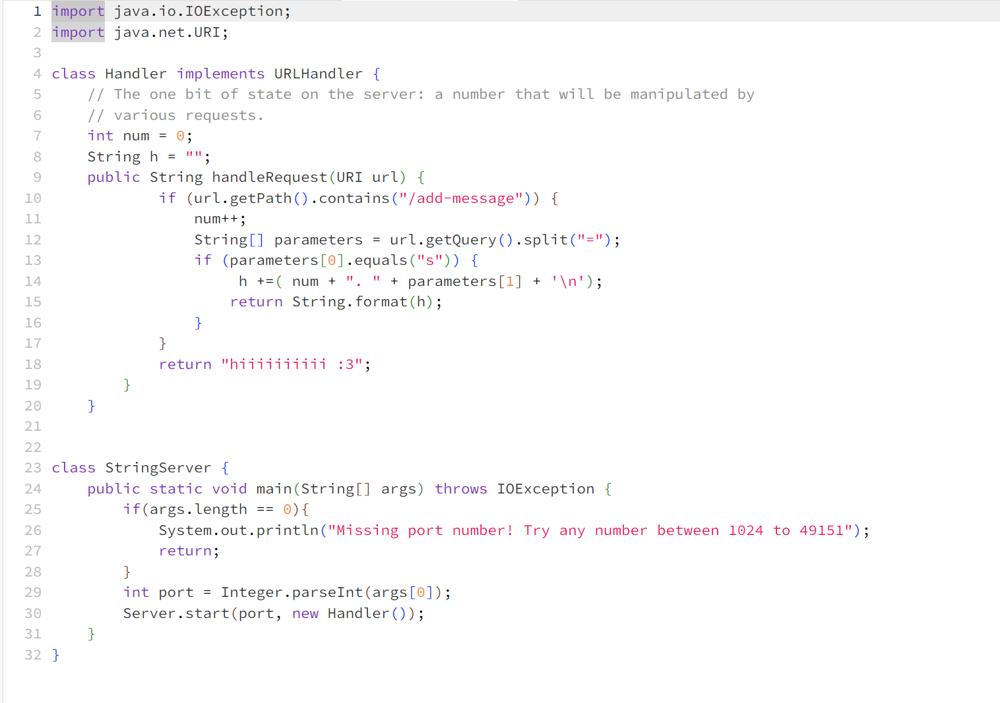
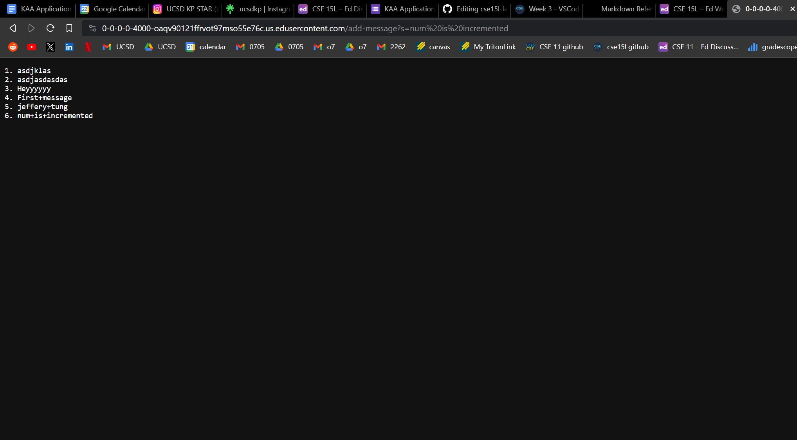

> Show the code for your ``StringServer``
```
import java.io.IOException;
import java.net.URI;

class Handler implements URLHandler {
    // The one bit of state on the server: a number that will be manipulated by
    // various requests.
    int num = 0;
    String h = "";
    public String handleRequest(URI url) {
            if (url.getPath().contains("/add-message")) {
                num++;
                String[] parameters = url.getQuery().split("=");
                if (parameters[0].equals("s")) {
                     h +=( num + ". " + parameters[1] + '\n');
                    return String.format(h);
                }
            }
            return "hiiiiiiiiii :3";
        }
    }


class StringServer {
    public static void main(String[] args) throws IOException {
        if(args.length == 0){
            System.out.println("Missing port number! Try any number between 1024 to 49151");
            return;
        }
        int port = Integer.parseInt(args[0]);
        Server.start(port, new Handler());
    }
}
```


> two screenshots of using ``/add-message``


>Which methods in your code are called?
>What are the relevant arguments to those methods, and the values of any relevant fields of the class?
>How do the values of any relevant fields of the class change from this specific request? If no values got changed, explain why.


>Which methods in your code are called?
>
>What are the relevant arguments to those methods, and the values of any relevant fields of the class?
>
>How do the values of any relevant fields of the class change from this specific request? If no values got changed, explain why.


 < this is because in the space or whatever is %20 in a url so we gotta do %20 >
