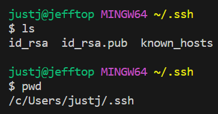
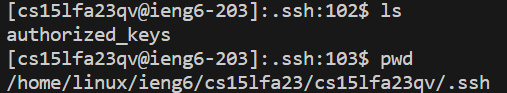
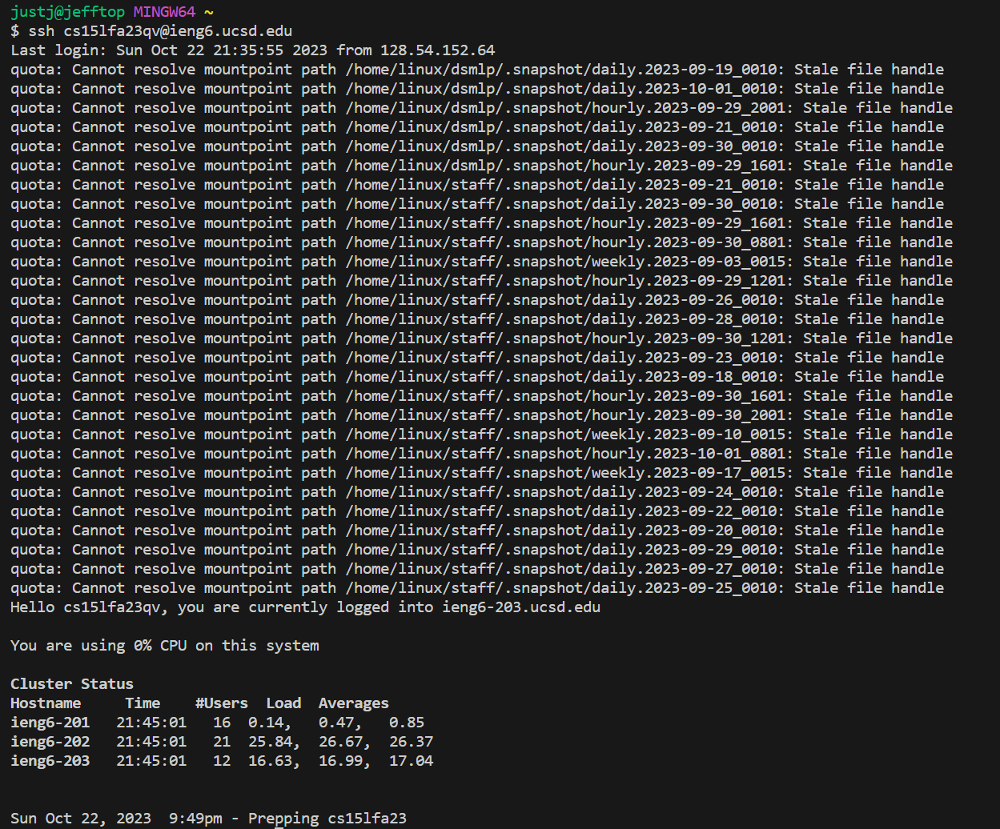

## PART 1

> Show the code for your ``StringServer``

```

import java.io.IOException;
import java.net.URI;

class Handler implements URLHandler {
    // The one bit of state on the server: a number that will be manipulated by
    // various requests.
    int num = 0;
    String h = "";
    public String handleRequest(URI url) {
            if (url.getPath().contains("/add-message")) {
                num++;
                String[] parameters = url.getQuery().split("=");
                if (parameters[0].equals("s")) {
                     h +=( num + ". " + parameters[1] + '\n');
                    return String.format(h);
                }
            }
            return "hiiiiiiiiii :3";
        }
    }


class StringServer {
    public static void main(String[] args) throws IOException {
        if(args.length == 0){
            System.out.println("Missing port number! Try any number between 1024 to 49151");
            return;
        }
        int port = Integer.parseInt(args[0]);
        Server.start(port, new Handler());
    }
}

```


>and two screenshots of using ``/add-message``


>Which methods in your code are called?

The ``handleRequest`` method is called.

>What are the relevant arguments to those methods, and the values of any relevant fields of the class?

Arguments:
``"jeffery tung"``

relevant fields:

``int num`` is ``5;``

``String h`` would have the number 1 to the current number, and a string for each number then a added new line character.

Example:

String h here would contain ``"1. asdjklas\n2.asdjasdasdas\n3.Heyyyyy\n4.First+message\n5.jeffery+tung"``

>How do the values of any relevant fields of the class change from this specific request? If no values got changed, explain why.

The values of the field for Handler gets changed based off of the string that I input into the request after the ``/add-message``. In this case I put my name, ``jeffery tung``, and it put a ``+`` between the spaces and was attached to ``String h``. Also the ``num`` variable is incremented by one so we can keep track of the amount of strings inputted alreayd.

>and two screenshots of using /add-message


>Which methods in your code are called?

The String ``handleRequest`` method are called.

>What are the relevant arguments to those methods, and the values of any relevant fields of the class?

Arguments: 

``"num is incremented"``

Fields:

``int num = 6``

``String h`` would have the numbers from 1 to the current number, with each number having the string i've put each time before and a new line character between each string and new number.
 
>How do the values of any relevant fields of the class change from this specific request? If no values got changed, explain why.

The values of the field gets changed based off of the string that I input into the request after the ``/add-message``. In this case I put (string) ``num is incremented``, and it put a ``+`` in between the spaces and was attached to the ``String h``. Also the ``num`` variable is incremented by one so we can keep track of the amount of strings inputted already.

## PART 2


>The path to the private key for your SSH key for logging into ieng6

 

```
justj@jefftop MINGW64 ~/.ssh
$ ls
id_rsa  id_rsa.pub  known_hosts

justj@jefftop MINGW64 ~/.ssh
$ pwd
/c/Users/justj/.ssh
```

>The path to the public key for your SSH key for logging into ieng6 (within your account on ieng6)



```
[cs15lfa23qv@ieng6-203]:.ssh:102$ ls
authorized_keys
[cs15lfa23qv@ieng6-203]:.ssh:103$ pwd
/home/linux/ieng6/cs15lfa23/cs15lfa23qv/.ssh
```

>A terminal interaction where you log into ieng6 with your course-specific account without being asked for a password.

 


## PART 3

I learned how to set it up so I wouldnt have to constantly log in over and over again with a password when i SSH into the computers, that I did not learn from Lab 1 and 2.
