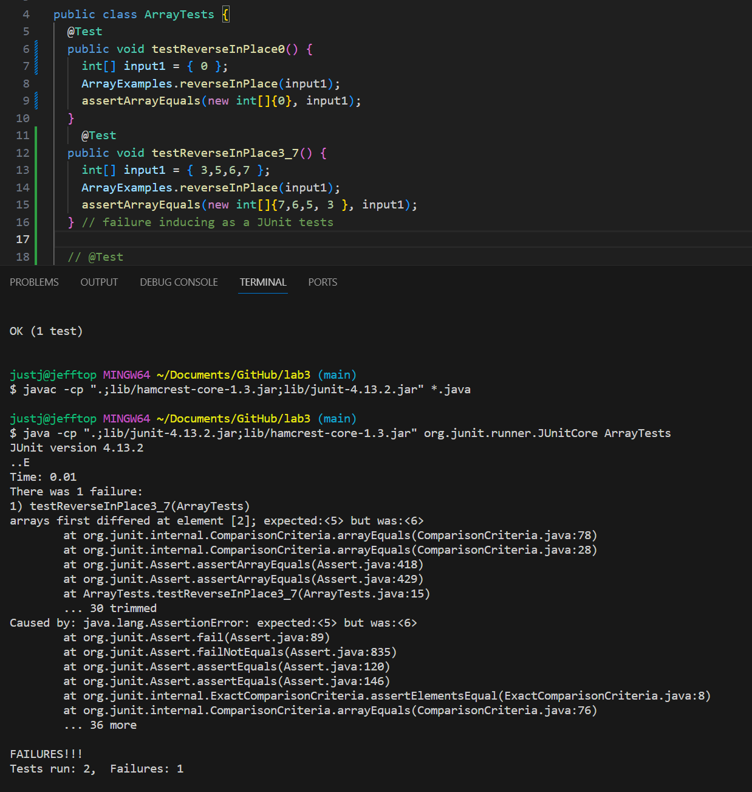

##PART 1

>A failure-inducing input for the buggy program, as a JUnit test and any associated code

```
	@Test 
	public void testReverseInPlace() {
    		int[] input1 = { 3,5,6,7 };
    		ArrayExamples.reverseInPlace(input1);
    		assertArrayEquals(new int[]{7,6,5, 3 }, input1);
	} // failure inducing as a JUnit tests
```


>An input that doesn’t induce a failure, as a JUnit test and any associated code 

``` 
	@Test 
	public void testReverseInPlace() {
   		  int[] input1 = { 0 };
  		  ArrayExamples.reverseInPlace(input1);
  		  assertArrayEquals(new int[]{0}, input1);
	}
```

>The symptom, as the output of running the tests (provide it as a screenshot of running JUnit with at least the two inputs above)



>The bug, as the before-and-after code change required to fix it
>BEFORE

```
    static void reverseInPlace(int[] arr) {
    	for(int i = 0; i < arr.length; i += 1) {
      		arr[i] = arr[arr.length - i - 1];
    }
  }
```

>The bug, as the before-and-after code change required to fix it
>AFTER

```
 static void reverseInPlace(int[] arr) {
    int[] h = new int[arr.length];
    for (int i : h){
      h[i] = arr[i];
    }
    for(int i = 0; i < arr.length; i += 1) {
      arr[i] = h[ (arr.length -  1) - i];
    }
  }
```

>Briefly describe why the fix addresses the issue.

The array was switching in place with itself, but had no way to store the values that it was losing. So when it reversed it, it would only reverse one half of the array and the other half would be mirrored. With this new code, we create a new integer array that first stores all the initial values and then corresponds them accordingly.


