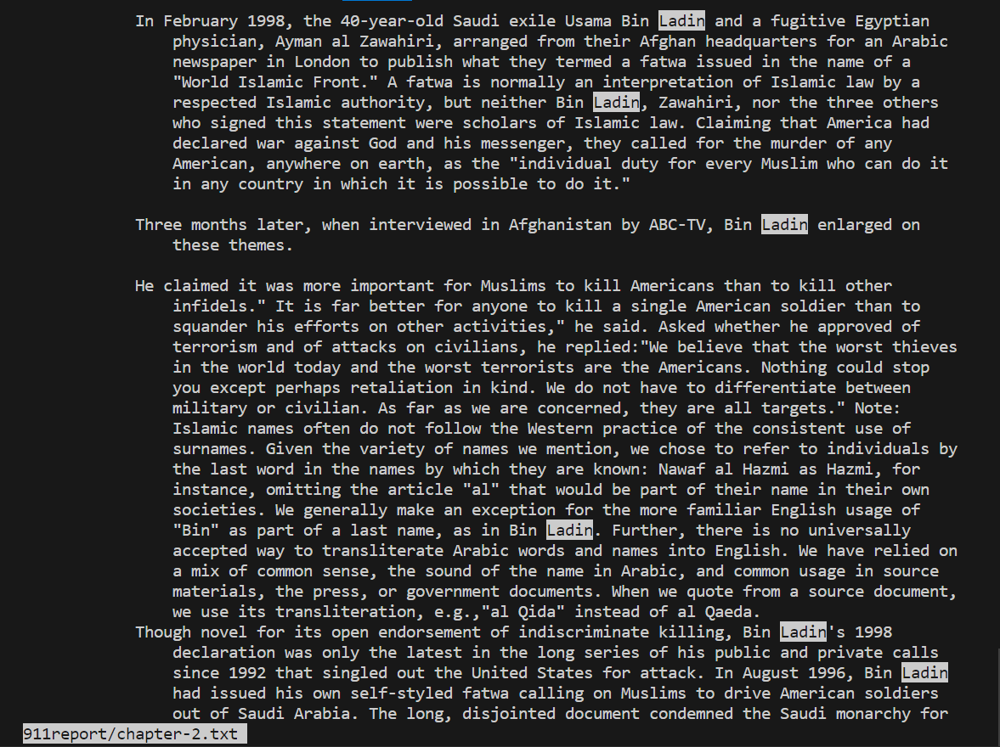
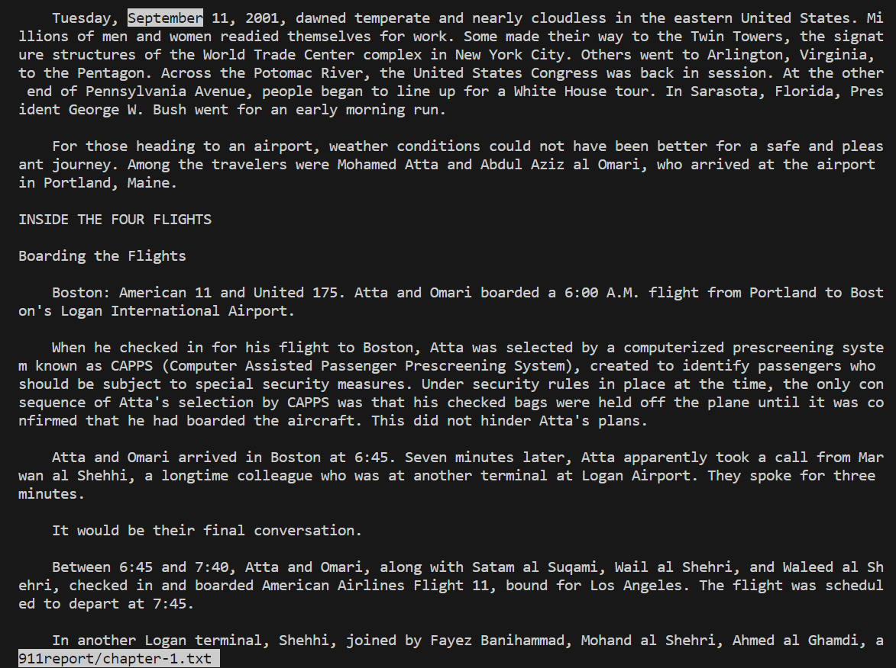

## PART 1

>A failure-inducing input for the buggy program, as a JUnit test and any associated code

```
	@Test 
	public void testReverseInPlace() {
    		int[] input1 = { 3,5,6,7 };
    		ArrayExamples.reverseInPlace(input1);
    		assertArrayEquals(new int[]{7,6,5, 3 }, input1);
	} // failure inducing as a JUnit tests
```


>An input that doesn’t induce a failure, as a JUnit test and any associated code 

``` 
	@Test 
	public void testReverseInPlace() {
   		  int[] input1 = { 0 };
  		  ArrayExamples.reverseInPlace(input1);
  		  assertArrayEquals(new int[]{0}, input1);
	}
```

>The symptom, as the output of running the tests (provide it as a screenshot of running JUnit with at least the two inputs above)

``` 
public class ArrayTests{
    @Test
    public void testReverseInPlace(input1);
    int[] input1 = {0};
    ArrayExamples.reverseInPlace(input1);
    assertArraysEquals(new int[]{0}, input1);

    @Test
    public void testReverseInPlace3_7(){
        int[] input1 = {3,5,6,7};
        ArrayExamples.reverseInPlace(input1);
        assertArraysEquals(new int[]{7,6,5 , 3}, input1); 
    }
} // failure inducing as a JUnit testss
```
``` 

justj@jefftop MINGW64 ~/Documents/GitHub/lab3 (main)
$ javac -cp ".;lib/hamcrest-core-1.3.jar;lib/junit-4.13.2.jar" *.java
justj@jefftop MINGW64 ~/Documents/GitHub/lab3 (main)
$ java -cp ".;lib/junit-4.13.2.jar;lib/hamcrest-core-1.3.jar" org.junit.runner.JUnitCore Array Tests JUnit version 4.13.2
..E
Time: 0.01
There was 1 failure:
1) testReverseInPlace3_7(Array Tests)
arrays first differed at element [2]; expected: <5> but was:<6>
at org.junit.internal.ComparisonCriteria.arrayEquals(ComparisonCriteria.java:78)
at
org.junit.internal.ComparisonCriteria.arrayEquals(ComparisonCriteria.java:28)
at org.junit.Assert.assertArrayEquals(Assert.java:418)
at org.junit.Assert.assertArrayEquals(Assert.java:429)
at ArrayTests.testReverseInPlace3_7(ArrayTests.java:15)
...30 trimmed
Caused by: java.lang.AssertionError: expected: <5> but was:<6>
at org.junit.Assert.fail(Assert.java:89)
at org.junit.Assert.failNotEquals(Assert.java:835)
at org.junit.Assert.assertEquals(Assert.java:120)
at org.junit.Assert.assertEquals(Assert.java:146)
at
org.junit.internal.ExactComparisonCriteria.assertElementsEqual(ExactComparisonCriteria.java:8)
at org.junit.internal.ComparisonCriteria.arrayEquals(ComparisonCriteria.java:76)
... 36 more
FAILURES!!!
Tests run: 2, Failures: 1
```

>The bug, as the before-and-after code change required to fix it

**BEFORE**

```
    static void reverseInPlace(int[] arr) {
    	for(int i = 0; i < arr.length; i += 1) {
      		arr[i] = arr[arr.length - i - 1];
    }
  }
```

>The bug, as the before-and-after code change required to fix it

**AFTER**

```
 static void reverseInPlace(int[] arr) {
    int[] h = new int[arr.length];
    for (int i : h){
      h[i] = arr[i];
    }
    for(int i = 0; i < arr.length; i += 1) {
      arr[i] = h[ (arr.length -  1) - i];
    }
  }
```

>Briefly describe why the fix addresses the issue.

The array was switching in place with itself, but had no way to store the values that it was losing. So when it reversed it, it would only reverse one half of the array and the other half would be mirrored. With this new code, we create a new integer array that first stores all the initial values and then corresponds them accordingly.

## PART 2
**SOURCES:** 
https://www.geeksforgeeks.org/less-command-linux-examples/#

https://man7.org/linux/man-pages/man1/less.1.html


---

> -x command 1

> https://man7.org/linux/man-pages/man1/less.1.html

``[cs15lfa23qv@ieng6-202]:technical:155$ less -X 911report/chapter-5.txt``
```
            AL QAEDA AIMS AT THE AMERICAN HOMELAND
            TERRORIST ENTREPRENEURS
            By early 1999, al Qaeda was already a potent adversary of the United States. Bin
                Ladin and his chief of operations, Abu Hafs al Masri, also known as Mohammed Atef,
                occupied undisputed leadership positions atop al Qaeda's organizational structure.
                Within this structure, al Qaeda's worldwide terrorist operations relied heavily on
                the ideas and work of enterprising and strongwilled field commanders who enjoyed
                considerable autonomy. To understand how the organization actually worked and to
                introduce the origins of the 9/11 plot, we briefly examine three of these
                subordinate commanders: Khalid Sheikh Mohammed (KSM), Riduan Isamuddin (better known
                as Hambali), and Abd al Rahim al Nashiri. We will devote the most attention to
                Khalid Sheikh Mohammed, the chief manager of the "planes operation." Khalid Sheikh
                Mohammed No one exemplifies the model of the terrorist entrepreneur more clearly
                than Khalid Sheikh Mohammed, the principal architect of the 9/11 attacks. KSM
                followed a rather tortuous path to his eventual membership in al Qaeda.

            Highly educated and equally comfortable in a government office or a terrorist
                safehouse, KSM applied his imagination, technical aptitude, and managerial skills to
                hatching and planning an extraordinary array of terrorist schemes. These ideas
                included conventional car bombing, political assassination, aircraft bombing,
                hijacking, reservoir poisoning, and, ultimately, the use of aircraft as missiles
                guided by suicide operatives.
            Like his nephew Ramzi Yousef (three years KSM's junior), KSM grew up in Kuwait but
                traces his ethnic lineage to the Baluchistan region straddling Iran and Pakistan.
                Raised in a religious family, KSM claims to have joined the Muslim Brotherhood at
                age 16 and to have become enamored of violent jihad at youth camps in the desert. In
                1983, following his graduation from secondary school, KSM left Kuwait to enroll at
                Chowan College, a small Baptist school in Murfreesboro, North Carolina. After a
                semester at Chowan, KSM transferred to North Carolina Agricultural and Technical
                State University in Greensboro, which he attended with Yousef 's brother, another
[cs15lfa23qv@ieng6-202]:technical:156$ s
bash: s: command not found...
[cs15lfa23qv@ieng6-202]:technical:157$ less -X 911report/chapter-5.txt


            AL QAEDA AIMS AT THE AMERICAN HOMELAND
            TERRORIST ENTREPRENEURS
            By early 1999, al Qaeda was already a potent adversary of the United States. Bin
                Ladin and his chief of operations, Abu Hafs al Masri, also known as Mohammed Atef,
                occupied undisputed leadership positions atop al Qaeda's organizational structure.
                Within this structure, al Qaeda's worldwide terrorist operations relied heavily on
                the ideas and work of enterprising and strongwilled field commanders who enjoyed
                considerable autonomy. To understand how the organization actually worked and to
                introduce the origins of the 9/11 plot, we briefly examine three of these
                subordinate commanders: Khalid Sheikh Mohammed (KSM), Riduan Isamuddin (better known
                as Hambali), and Abd al Rahim al Nashiri. We will devote the most attention to
                Khalid Sheikh Mohammed, the chief manager of the "planes operation." Khalid Sheikh
                Mohammed No one exemplifies the model of the terrorist entrepreneur more clearly
                than Khalid Sheikh Mohammed, the principal architect of the 9/11 attacks. KSM
                followed a rather tortuous path to his eventual membership in al Qaeda.

            Highly educated and equally comfortable in a government office or a terrorist
                safehouse, KSM applied his imagination, technical aptitude, and managerial skills to
                hatching and planning an extraordinary array of terrorist schemes. These ideas
                included conventional car bombing, political assassination, aircraft bombing,
                hijacking, reservoir poisoning, and, ultimately, the use of aircraft as missiles
                guided by suicide operatives.
            Like his nephew Ramzi Yousef (three years KSM's junior), KSM grew up in Kuwait but
                traces his ethnic lineage to the Baluchistan region straddling Iran and Pakistan.
                Raised in a religious family, KSM claims to have joined the Muslim Brotherhood at
                age 16 and to have become enamored of violent jihad at youth camps in the desert. In
                1983, following his graduation from secondary school, KSM left Kuwait to enroll at
                Chowan College, a small Baptist school in Murfreesboro, North Carolina. After a
                semester at Chowan, KSM transferred to North Carolina Agricultural and Technical
                State University in Greensboro, which he attended with Yousef 's brother, another
[cs15lfa23qv@ieng6-202]:technical:158$
```

The command ``-x`` does not clear the terminal when you exit the file, which could be helpful if you need to refer to it back real quick. Maybe I forgot where KSM transferred to and I need to see it in the file.

> -x command 2

> https://man7.org/linux/man-pages/man1/less.1.html

``[cs15lfa23qv@ieng6-202]:technical:155$ less -X 911report/chapter-5.txt``
```
         [cs15lfa23qv@ieng6-202]:technical:155$ less -X 911report/chapter-5.txt


            AL QAEDA AIMS AT THE AMERICAN HOMELAND
            TERRORIST ENTREPRENEURS
            By early 1999, al Qaeda was already a potent adversary of the United States. Bin
                Ladin and his chief of operations, Abu Hafs al Masri, also known as Mohammed Atef,
                occupied undisputed leadership positions atop al Qaeda's organizational structure.
                Within this structure, al Qaeda's worldwide terrorist operations relied heavily on
                the ideas and work of enterprising and strongwilled field commanders who enjoyed
                considerable autonomy. To understand how the organization actually worked and to
                introduce the origins of the 9/11 plot, we briefly examine three of these
                subordinate commanders: Khalid Sheikh Mohammed (KSM), Riduan Isamuddin (better known
                as Hambali), and Abd al Rahim al Nashiri. We will devote the most attention to
                Khalid Sheikh Mohammed, the chief manager of the "planes operation." Khalid Sheikh
                Mohammed No one exemplifies the model of the terrorist entrepreneur more clearly
                than Khalid Sheikh Mohammed, the principal architect of the 9/11 attacks. KSM
                followed a rather tortuous path to his eventual membership in al Qaeda.

            Highly educated and equally comfortable in a government office or a terrorist
                safehouse, KSM applied his imagination, technical aptitude, and managerial skills to
                hatching and planning an extraordinary array of terrorist schemes. These ideas
                included conventional car bombing, political assassination, aircraft bombing,
                hijacking, reservoir poisoning, and, ultimately, the use of aircraft as missiles
                guided by suicide operatives.
            Like his nephew Ramzi Yousef (three years KSM's junior), KSM grew up in Kuwait but
                traces his ethnic lineage to the Baluchistan region straddling Iran and Pakistan.
                Raised in a religious family, KSM claims to have joined the Muslim Brotherhood at
                age 16 and to have become enamored of violent jihad at youth camps in the desert. In
                1983, following his graduation from secondary school, KSM left Kuwait to enroll at
                Chowan College, a small Baptist school in Murfreesboro, North Carolina. After a
                semester at Chowan, KSM transferred to North Carolina Agricultural and Technical
                State University in Greensboro, which he attended with Yousef 's brother, another
[cs15lfa23qv@ieng6-202]:technical:156$ s
bash: s: command not found...
[cs15lfa23qv@ieng6-202]:technical:157$ less -X 911report/chapter-5.txt


            AL QAEDA AIMS AT THE AMERICAN HOMELAND
            TERRORIST ENTREPRENEURS
            By early 1999, al Qaeda was already a potent adversary of the United States. Bin
                Ladin and his chief of operations, Abu Hafs al Masri, also known as Mohammed Atef,
                occupied undisputed leadership positions atop al Qaeda's organizational structure.
                Within this structure, al Qaeda's worldwide terrorist operations relied heavily on
                the ideas and work of enterprising and strongwilled field commanders who enjoyed
                considerable autonomy. To understand how the organization actually worked and to
                introduce the origins of the 9/11 plot, we briefly examine three of these
                subordinate commanders: Khalid Sheikh Mohammed (KSM), Riduan Isamuddin (better known
                as Hambali), and Abd al Rahim al Nashiri. We will devote the most attention to
                Khalid Sheikh Mohammed, the chief manager of the "planes operation." Khalid Sheikh
                Mohammed No one exemplifies the model of the terrorist entrepreneur more clearly
                than Khalid Sheikh Mohammed, the principal architect of the 9/11 attacks. KSM
                followed a rather tortuous path to his eventual membership in al Qaeda.

            Highly educated and equally comfortable in a government office or a terrorist
                safehouse, KSM applied his imagination, technical aptitude, and managerial skills to
                hatching and planning an extraordinary array of terrorist schemes. These ideas
                included conventional car bombing, political assassination, aircraft bombing,
                hijacking, reservoir poisoning, and, ultimately, the use of aircraft as missiles
                guided by suicide operatives.
            Like his nephew Ramzi Yousef (three years KSM's junior), KSM grew up in Kuwait but
                traces his ethnic lineage to the Baluchistan region straddling Iran and Pakistan.
                Raised in a religious family, KSM claims to have joined the Muslim Brotherhood at
                age 16 and to have become enamored of violent jihad at youth camps in the desert. In
                1983, following his graduation from secondary school, KSM left Kuwait to enroll at
                Chowan College, a small Baptist school in Murfreesboro, North Carolina. After a
                semester at Chowan, KSM transferred to North Carolina Agricultural and Technical
                State University in Greensboro, which he attended with Yousef 's brother, another
[cs15lfa23qv@ieng6-202]:technical:158$ less -X 911report/chapter-6.txt


            FROM THREAT TO THREAT
            In chapters 3 and 4 we described how the U.S. government adjusted its existing
                agencies and capacities to address the emerging threat from Usama Bin Ladin and his
                associates. After the August 1998 bombings of the American embassies in Kenya and
                Tanzania, President Bill Clinton and his chief aides explored ways of getting Bin
                Ladin expelled from Afghanistan or possibly capturing or even killing him. Although
                disruption efforts around the world had achieved some successes, the core of Bin
                Ladin's organization remained intact. President Clinton was deeply concerned about
                Bin Ladin. He and his national security advisor, Samuel "Sandy" Berger, ensured they
                had a special daily pipeline of reports feeding them the latest updates on Bin
                Ladin's reported location.

            In public, President Clinton spoke repeatedly about the threat of terrorism,
                referring to terrorist training camps but saying little about Bin Ladin and nothing
                about al Qaeda. He explained to us that this was deliberate-intended to avoid
                enhancing Bin Ladin's stature by giving him unnecessary publicity. His speeches
                focused especially on the danger of nonstate actors and of chemical and biological
                    weapons.

            As the millennium approached, the most publicized worries were not about terrorism
                but about computer breakdowns-the Y2K scare. Some government officials were
                concerned that terrorists would take advantage of such breakdowns.

            THE MILLENNIUM CRISIS
            "Bodies Will Pile Up in Sacks"
            On November 30, 1999, Jordanian intelligence intercepted a telephone call between Abu
                Zubaydah, a longtime ally of Bin Ladin, and Khadr Abu Hoshar, a Palestinian
                extremist. Abu Zubaydah said, "The time for training is over." Suspecting that this
                was a signal for Abu Hoshar to commence a terrorist operation, Jordanian police
                arrested Abu Hoshar and 15 others and informed Washington.
[cs15lfa23qv@ieng6-202]:technical:159$
```


The command ``-x`` does not clear the terminal when you exit the file, which could be helpful if you need to refer to it back real quick. 

---
> -p command 1

> https://man7.org/linux/man-pages/man1/less.1.html

``[cs15lfa23qv@ieng6-202]:technical:129$ less -p "Ladin" 911report/chapter-2.txt``

```
            In February 1998, the 40-year-old Saudi exile Usama Bin Ladin and a fugitive Egyptian
                physician, Ayman al Zawahiri, arranged from their Afghan headquarters for an Arabic
                newspaper in London to publish what they termed a fatwa issued in the name of a
                "World Islamic Front." A fatwa is normally an interpretation of Islamic law by a
                respected Islamic authority, but neither Bin Ladin,
```

Although I cannot show it in the code block, the command highlighted all instances of the "Ladin" inside the text of the directory of the file i specified. Cut off for convenience.
Once again cut off for convenience.


> -p command 2

> https://www.geeksforgeeks.org/less-command-linux-examples/#

``[cs15lfa23qv@ieng6-202]:technical:132$ less -p "September" 911report/chapter-1.txt``
```
Tuesday, September 11, 2001, dawned temperate and nearly cloudless in the eastern United States. Millions of men and women readied themselves for work. Some made their way to the Twin Towers, the signature structures of the World Trade Center complex in New York City. Others went to Arlington, Virginia, to the Pentagon. Across the Potomac River, the United States Congress was back in session. At the other end of Pennsylvania Avenue, people began to line up for a White House tour. In Sarasota, Florida, President George W. Bush went for an early morning run.
```


Although I cannot show it in the code block, the command highlighted all instances of the "September" inside the text of the directory of the file i specified. Cut off for convenience.
Once again cut off for convenience.

---
> -N command 1

> https://www.geeksforgeeks.org/less-command-linux-examples/#


``[cs15lfa23qv@ieng6-202]:technical:135$ less -N 911report/chapter-1.txt ``

```
      1
      2
      3
      4 "WE HAVE SOME PLANES"
      5
      6     Tuesday, September 11, 2001, dawned temperate and nearly cloudless in the eastern United States. Mi      6 llions of men and women readied themselves for work. Some made their way to the Twin Towers, the signat      6 ure structures of the World Trade Center complex in New York City. Others went to Arlington, Virginia,       6 to the Pentagon. Across the Potomac River, the United States Congress was back in session. At the other      6  end of Pennsylvania Avenue, people began to line up for a White House tour. In Sarasota, Florida, Pres      6 ident George W. Bush went for an early morning run.
```


the ``-N``  command line option shows the text of the file with numbers for each line. Good for formatting purposes, for things like LaTeX. Once again, cut off for convenience.

> -N command 2

> https://www.geeksforgeeks.org/less-command-linux-examples/#

`` [cs15lfa23qv@ieng6-202]:technical:135$ less -N 911report/chapter-2.txt`` 

``` 
      1
      2
      3
      4             THE FOUNDATION OF THE NEW TERRORISM
      5             A DECLARATION OF WAR
      6             In February 1998, the 40-year-old Saudi exile Usama Bin Ladin and a fugitive Egyptian      
      7                 physician, Ayman al Zawahiri, arranged from their Afghan headquarters for an Arabic    
      8                 newspaper in London to publish what they termed a fatwa issued in the name of a  
```
the ``-N``  command line option shows the text of the file with numbers for each line. Good if you are looking to cite a txt file and need to find which line. Once again, cut off for convenience.

---


> -S command 1

> https://www.geeksforgeeks.org/less-command-linux-examples/#


``[cs15lfa23qv@ieng6-202]:technical:144$ less -s 911report/chapter-2.txt ``
```
HE FOUNDATION OF THE NEW TERRORISM
            A DECLARATION OF WAR
            In February 1998, the 40-year-old Saudi exile Usama Bin Ladin and a fugitive Egyptian
                physician, Ayman al Zawahiri, arranged from their Afghan headquarters for an Arabic
                newspaper in London to publish what they termed a fatwa issued in the name of a
                "World Islamic Front." A fatwa is normally an interpretation of Islamic law by a
                respected Islamic authority, but neither Bin Ladin, Zawahiri, nor the three others
                who signed this statement were scholars of Islamic law. Claiming that America had
                declared war against God and his messenger, they called for the murder of any
                American, anywhere on earth, as the "individual duty for every Muslim who can do it
                in any country in which it is possible to do it."

            Three months later, when interviewed in Afghanistan by ABC-TV, Bin Ladin enlarged on
                these themes.
```


This command with the ``-s`` lets the file wrap around the terminal to make it a little more readable. It is wrapping the text about the declaration of war to fit in the terminal.

> -S command 2

> https://www.geeksforgeeks.org/less-command-linux-examples/#


`` [cs15lfa23qv@ieng6-202]:technical:146$ less -s 911report/chapter-5.txt``

```
   AL QAEDA AIMS AT THE AMERICAN HOMELAND
            TERRORIST ENTREPRENEURS
            By early 1999, al Qaeda was already a potent adversary of the United States. Bin
                Ladin and his chief of operations, Abu Hafs al Masri, also known as Mohammed Atef,
                occupied undisputed leadership positions atop al Qaeda's organizational structure.
                Within this structure, al Qaeda's worldwide terrorist operations relied heavily on
```
This command with the ``-s`` lets the file wrap around the terminal to make it a little more readable. Can be good if you do not have a big screen or a square computer monitor.

---


>That makes 8 total examples, all focused on a single command. There should be two examples each for four different command-line options.


