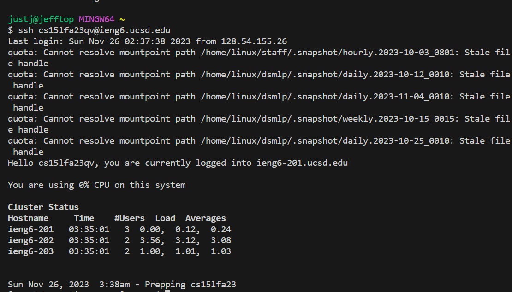
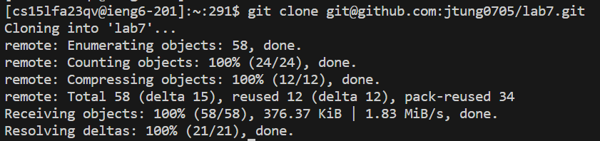
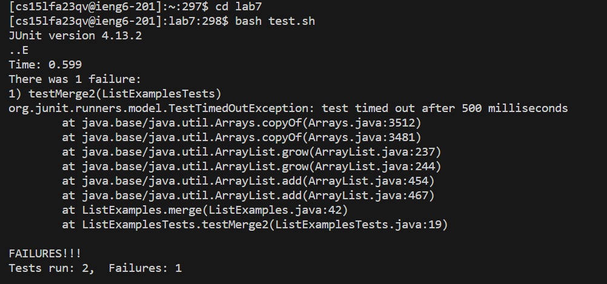

## **STEP 4**
---

Keys pressed: ``<up><enter>``

The ``ssh cs15lfa23qv@ieng6.ucsd.edu`` command was up one in the history, so I pressed up and enter to obtain and run it.

##**STEP 5**
---

Keys pressed: `` <Ctrl><R><git><enter>``

The ``git clone git@github.com:jtung0705/lab7.git`` command was there after I searched for ``git`` inside the commands, so I pressed enter to run it.

##**STEP 6**
---

Keys pressed: ``cd lab7``
Keys pressed: ``bash test.sh``

I was in the home directory, so I had to change to the ``lab7`` directory.
The ``test.sh`` bash script was there, so I typed ``bash test.sh`` to run it.
It then displayed the tests that executed.

##**STEP 7**
---

Keys pressed: `` ``

The ``                          `` command was there, so I pressed enter to run it.

##**STEP 8**
---

Keys pressed: `` ``

The ``                          `` command was there, so I pressed enter to run it.

##**STEP 9**
---

Keys pressed: `` ``

The ``                          `` command was there, so I pressed enter to run it.
