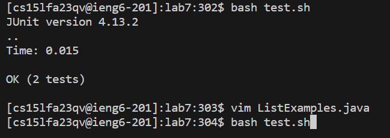
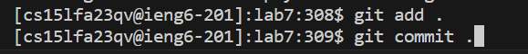
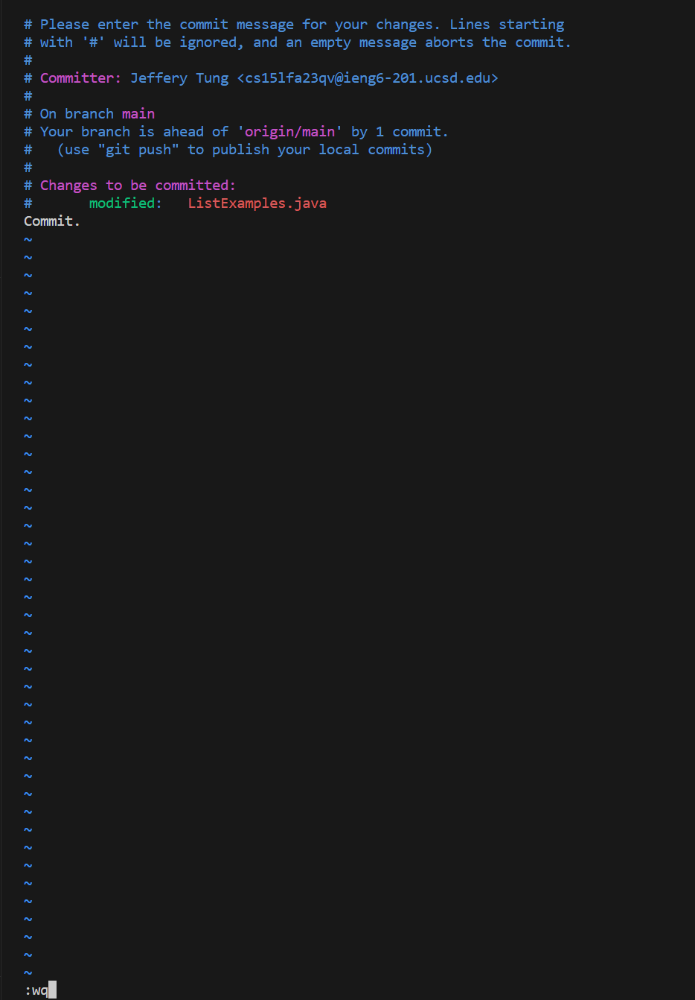
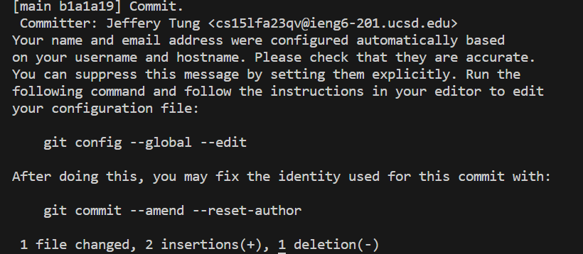

## **STEP 4**
---

Keys pressed: ``<up><enter>``

The ``ssh cs15lfa23qv@ieng6.ucsd.edu`` command was up one in the history, so I pressed up and enter to obtain and run it.

##**STEP 5**
---

Keys pressed: ``<Ctrl> R``

Keys pressed:``git``

Keys pressed:``<enter>``

The ``git clone git@github.com:jtung0705/lab7.git`` command was there after I searched for ``git`` using ``<Ctrl>`` and ``R``, so I pressed enter to run it.

## **STEP 6**
---

Keys pressed: ``cd lab7``

Keys pressed: ``bash test.sh``

I was in the home directory, so I had to change to the ``lab7`` directory.
The ``test.sh`` bash script was there, so I typed ``bash test.sh`` to run it.
It then displayed the tests that executed.

## **STEP 7**
---

Keys pressed: ``vim ListExamples.java``

Keys pressed: ``<up><up><up><up><up><up>``

Keys pressed: ``<right><right><right><right><right><right><right><right><right><right><right><right><i>``

Keys pressed: ``<backspace><2>``

Keys pressed: ``<esc>``

Keys pressed: ``:wq``

The ``vim ListExamples.java`` command was typed so I could see the text of ``ListExamples.java``, so I pressed enter to run it.
Afterwards, I kept going up and right to access the mistake of the file and pressed ``i`` to enter insert mode.
With it, I deleted the incorrect character and replaced it with the right one, and pressed ``esc`` to leave insert mode.
Once done, I typed ``:wq`` to write it and quit so it would save.

## **STEP 8**
---

Keys pressed: ``<up><up><Enter>``

The ``bash test.sh`` command was already there from the first time I executed it, so I pressed ``<up>`` twice to get the command and then pressed ``<enter>`` to run it.

## **STEP 9**
---

Keys pressed: ``git add .``

Keys pressed: ``<enter>``

Keys pressed: ``git commit``

Keys pressed: ``<enter>``

Keys pressed: ``<down><down><down><down><down><down><down><down><down><down><down>``

Keys pressed: ``i``

Keys pressed: ``Commit.``

Keys pressed: ``<esc>``

Keys pressed: ``:wq``

The ``git add .`` command was so I could add all files in current and subdirectories to the staging area and I pressed enter to run it. Then I had to ``git commit`` to make sure it actually got pushed to the repository, and pressed ``<enter>`` to execute it. With that, I had to make a commit message so I scrolled down using the 11 ``<down>``s and pressed ``i`` for insert mode. Then I typed ``Commit.`` to type a commit message, and exited it with ``<esc>`` key. Then I typed ``:wq`` so I would be able to exit and save my commit message. After that, it displayed a message showing the new commit that just happened, and who commited.
