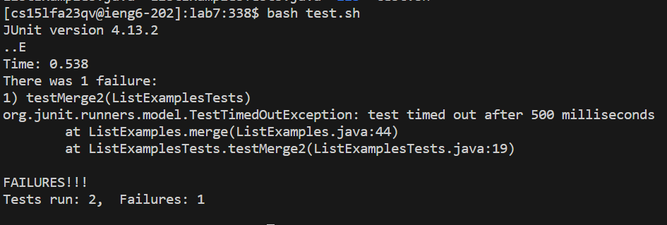
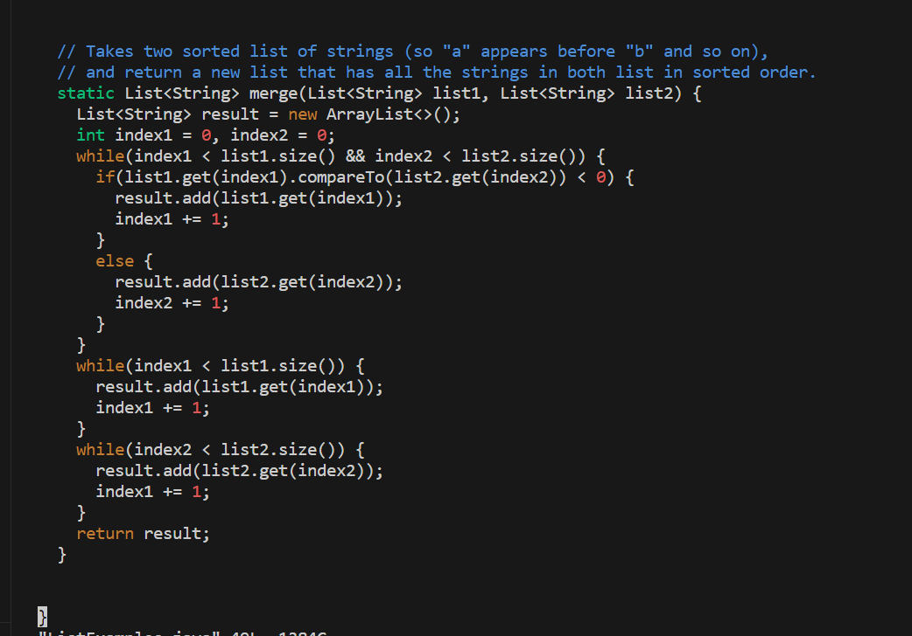
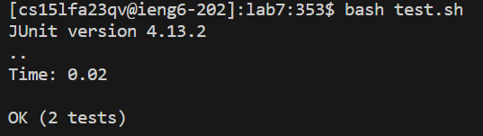

# PART 1

> The original post from a student with a screenshot showing a symptom and a description of a guess at the bug/some sense of what the failure-inducing input is. (Don’t actually make the post! Just write the content that would go in such a post)

**Student**: Hello, I am having trouble on this part of the code. I think the bug might be where it adds? 

 


>A response from a TA asking a leading question or suggesting a command to try (To be clear, you are mimicking a TA here.)

**TA:**: Hello, you are close but check again on where you're adding in the second while loop. Use ``vim`` to edit and recompile after. That may help. Good luck!

>Another screenshot/terminal output showing what information the student got from trying that, and a clear description of what the bug is.

**Student**: Wow, I got the information that the second while loop contained ``index1`` instead of ``index2``, so it would keep adding to the wrong array. I edited it to be ``index2`` and now it works. Thank you so much TA who was so awesome to give a 1/3 on this lab report!



>At the end, all the information needed about the setup including:

> **The file & directory structure needed**

home

----lab7

-------ListExamples.java

-------ListExamplesTests.java

-------test.sh

-------lib

------------hamcrest-core-1.3.jar

------------junit-4.13.2.jar

> **The contents of each file before fixing the bug**

``ListExamplesTest.java`` contains just a bunch of random tests to do.
```
import static org.junit.Assert.*;
import org.junit.*;
import java.util.*;
import java.util.ArrayList;


public class ListExamplesTests {
	@Test(timeout = 500)
	public void testMerge1() {
    		List<String> l1 = new ArrayList<String>(Arrays.asList("x", "y"));
		List<String> l2 = new ArrayList<String>(Arrays.asList("a", "b"));
		assertArrayEquals(new String[]{ "a", "b", "x", "y"}, ListExamples.merge(l1, l2).toArray());
	}
	
	@Test(timeout = 500)
        public void testMerge2() {
		List<String> l1 = new ArrayList<String>(Arrays.asList("a", "b", "c"));
		List<String> l2 = new ArrayList<String>(Arrays.asList("c", "d", "e"));
		assertArrayEquals(new String[]{ "a", "b", "c", "c", "d", "e" }, ListExamples.merge(l1, l2).toArray());
        }

}
```

``ListExamples.java`` contains files for the implementation to sort the list.

```
import java.util.ArrayList;
import java.util.List;

interface StringChecker { boolean checkString(String s); }

class ListExamples {

  // Returns a new list that has all the elements of the input list for which
  // the StringChecker returns true, and not the elements that return false, in
  // the same order they appeared in the input list;
  static List<String> filter(List<String> list, StringChecker sc) {
    List<String> result = new ArrayList<>();
    for(String s: list) {
      if(sc.checkString(s)) {
        result.add(s);
      }
    }
    return result;
  }


  // Takes two sorted list of strings (so "a" appears before "b" and so on),
  // and return a new list that has all the strings in both list in sorted order.
  static List<String> merge(List<String> list1, List<String> list2) {
    List<String> result = new ArrayList<>();
    int index1 = 0, index2 = 0;
    while(index1 < list1.size() && index2 < list2.size()) {
      if(list1.get(index1).compareTo(list2.get(index2)) < 0) {
        result.add(list1.get(index1));
        index1 += 1;
      }
      else {
        result.add(list2.get(index2));
        index2 += 1;
      }
    }
    while(index1 < list1.size()) {
      result.add(list1.get(index1));
      index1 += 1;
    }
    while(index2 < list2.size()) {
      result.add(list2.get(index2));
      index1 += 1;
    }
    return result;
  }


}
```


> **The full command line (or lines) you ran to trigger the bug**

``bash test.sh``

> **A description of what to edit to fix the bug**

Change the ``index1`` in the ``ListExamples.java`` in

```
    while(index2 < list2.size()) {
      result.add(list2.get(index2));
      index1 += 1;
    }
```

to ``index2``, like below:

```
    while(index2 < list2.size()) {
      result.add(list2.get(index2));
      index2 += 1; // changed !
    }
```


# PART 2

I mostly learned about Git in the second half of this quarter, which I thought was interesting because you always see it on internship oppurtunities, but I thought it was the same as GitHub. I'm pretty glad I learend about it because i know that it's important if you want to get into Software Engineering, but I feel like most schools do not teach it and you learn it on the workplace.
